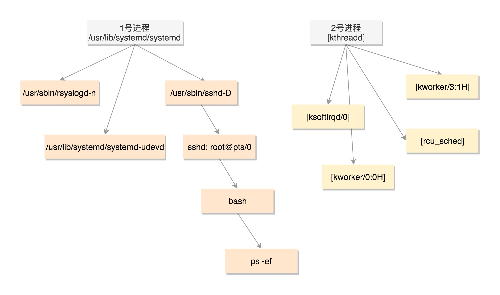
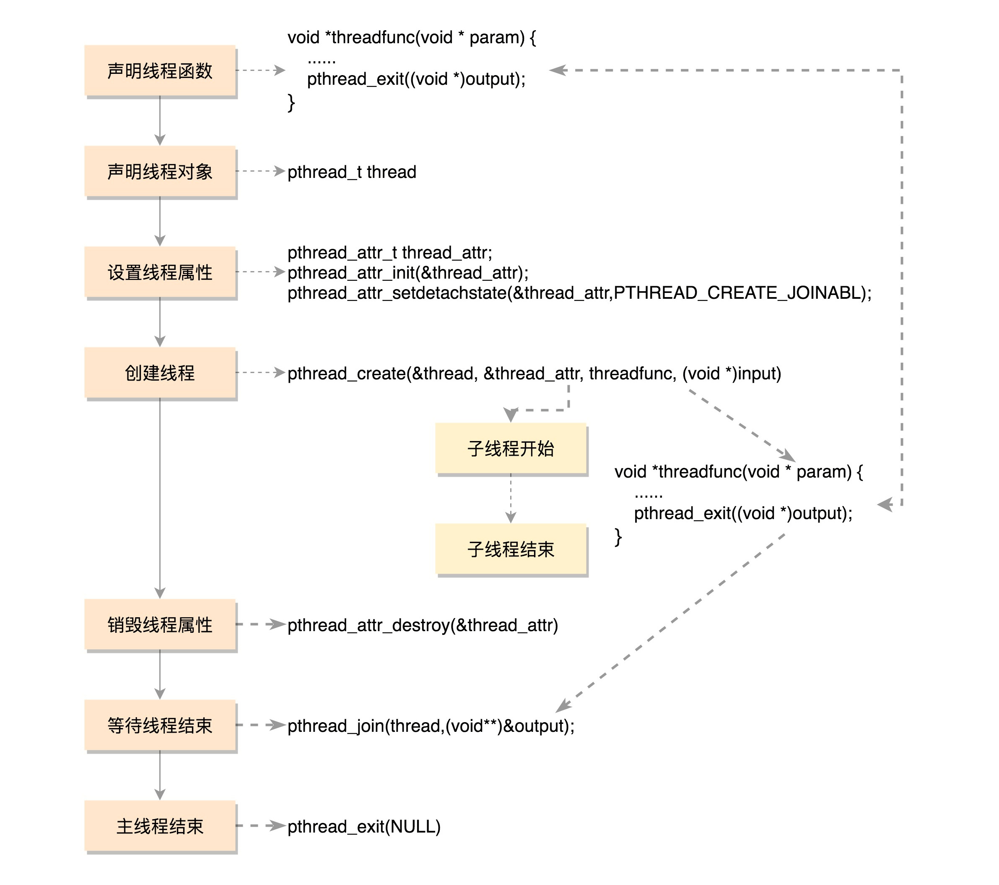
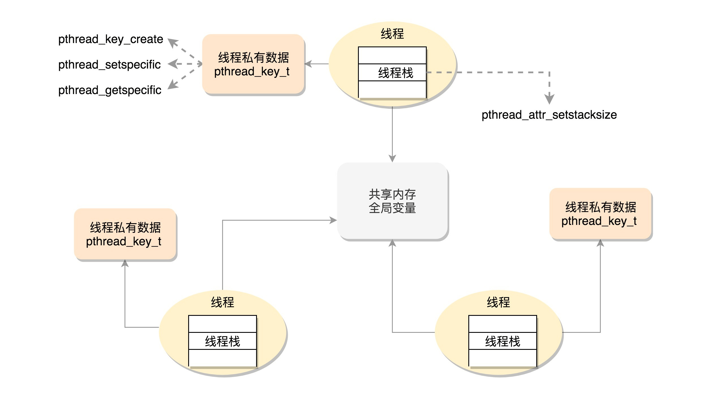
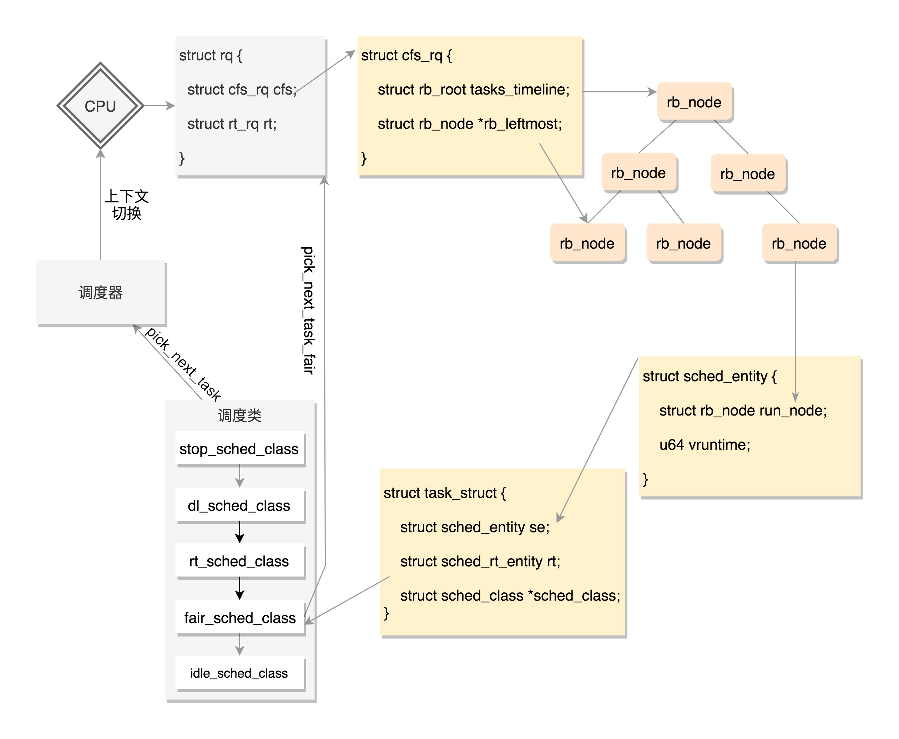
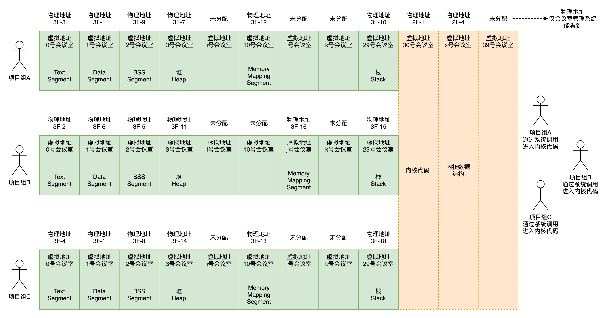
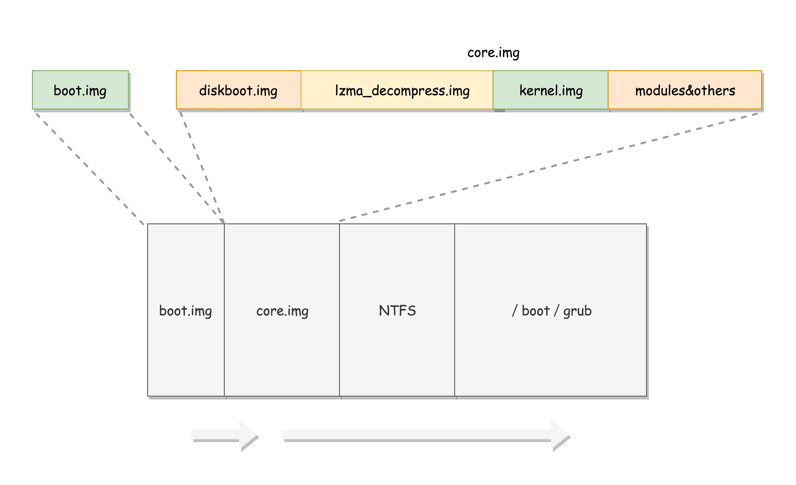

# Linux

## 进程，线程

### 概念上的区别

对于用户来说，用fork来创造一个新的进程，用pthread_create来创建一个新的线程，这两个方法最终都会使用系统调用clone来实现，不同的是参数。
对于内核来说，进程和线程的区别不大， 线程是一种特殊的进程，内核调度的单位是线程。

进程之间的内存空间是独立的，而同一组线程共享同一个内存空间（虚拟的），他们都认为自己独占一个CPU（虚拟的）。

进程和线程的数据结构类似，他们都有一个task_struct，而且task_struct由一个内核提供的双向循环链表链起来（这个双向循环链表很有意思需要注意）。


### task_truct和内存栈

在2.6以后的内核，task_struct这个结构是由slab（内存池）动态分配的，而Linux给每一个task都分配一个内核栈，在这个内核栈的最底端，存放一个结构叫做thread_info，thread_info第一个指针指向task_struct以方便X86直接通过栈指针就可以找到它。反过来task_struct也保存了thread_info的地址，他们都可以简单的函数查到彼此。pg_regs用来保存用户态陷入内核时的CPU寄存器。


### 创建进程

进程创建的过程是 fork->成功后返回PID->exec族->load_elf_binary


fork的主要流程  
fork  

```C
|->do_fork  
    |->copy_process  
    |->wake_up_new_task  
```

copy_process  
    1. 为新进程创建内核栈，task_struct, thread_info，拷贝之后内容完全一致  
    2. 确保系统资源足够（PID）  
    3. 清理统计信息  
    4. 将子进程设为不可调度的状态  
    5. 初始化优先级，调度类（normal/realtime）  
    6. 分配一个有效的PID，设置 tgid，group_leader，并且建立进程之间的亲缘关系  
    7. 根据clone的参数，拷贝或共享打开的文件，文件系统信息，信号处理函数，进程地址空间，命名空间等资源  
wake_up_new_task  
    1. 将子进程设为running，根据进程类型enque接受调度
    2. 尝试是否可以抢占父进程，这里只是做比较，通过结果标记父进程是否可以被强占
    3. 因为fork是一个系统调用，在返回的时候有一个抢占的机会，如果父进程可抢占，则在此时调用exec

### 创建线程

和进程不同的点：

1. fork是一个系统调用，pthread是一个GLIBC函数，它最终会调到clone  
2. 线程在用户态由自己单独的一个数据结构pthread
3. 线程有自己的线程栈，这个线程栈是从进程的堆里面分配出来的，一个进程的主线程使用的就是进程栈，而其它线程都用自己的栈
4. 每一个子线程都有自己的task_struct, 我们希望这个task_struct里面的用户态的栈能保存线程自己的栈，这样从内核态返回的时候就会回到自己的栈，因此create_thread将线程要执行的函数的参数和指令的位置都压到栈里面
5. clone的时候，进程是复制一份新的，而线程是对file，mm，sig这些结构增加一个引用计数
6. 亲缘关系的处理，要区分创建新线程的时候是不是同时创建一个新的进程，相应的tgid，parent，groupleader会受影响
7. 信号处理有可能不一样，有可能处理只针对这个线程的信号，这样这个信号就不会影响整个进程
8. 不是通过exec来执行新的函数，而是通过start_thread调用用户相关函数


### 进程树

用户空间的进程由init(1) 创建，通常它link到systemmd
内核空间的进程由kthreadd（2）创建
而它们都由0号进程所创建


所有的进程都应该在这个树上，并且他们之间也是用过双向循环链表把task_struct连起来的，所以通过一个进程可以找到任意一个进程。

ps的时候可以看到PID和PPID，CMD带方括号的是内核进程。

ps的时候看到的每一行都是线程，因此可以看到多个进程的不同线程，他们之间的区别就是PID不同，有可能cmd的参数不同。

tgid和group_leader通常都是同一个，指的是进程的主线程。

parent和real_parent通常一样，但有可能不同，如果在 bash 上使用 GDB 来 debug 一个进程，这个时候 GDB 是 parent，bash 是这个进程的 real_parent。

### 进程终止

进程结束在显示地调用exit或者函数返回时编译器默认调用exit，此时进入终止流程

1. 修改task_struct的flag为PF_EXITING
2. 删除相关的内核定时器
3. 输出记账信息
4. 释放进程的内存空间
5. 如果进程在等IPC，从排队队列中退出
6. 减少文件描述符，文件系统的引用计数，如果计数降为0，释放资源
7. 把存放在task_struct的exit_code置为由exit提供的退出代码，或者去完成任何其它由内核机制规定的退出动作。退出代码存放在这里供父进程随时检索。
8. 调用exit_notify通知父进程为自己的子进程寻找养父，养父可以为线程组中的其它线程或者init进程，讲自己设为EXIT_ZOMBIE
9. 调用do_exit，调用schedule切换到新的进程

进程变成ZOMBIE之后，他的内核栈，thread_info, task_struct还没有释放，这些资源必须由他的父进程来处理。因此父进程需要wait（族）等待子进程退出，并释放资源。

如果父进程没有调用wait，就会造成僵尸进程得不到释放。
解决方法：

1. kill父进程
2. 给父进程发SIGCHILD信号，父进程要接收这个信号并处理
3. fork两次，第一次直接退出，这样使第二个进程被交给init进程

### 线程终止

和进程类似，主线程需要等待子线程结束，子线程通过pthread_exit退出，父线程通过pthread_addr_destroy回收线程参数，通过pthread_join获取子线程返回结果。


每个线程有自己的栈，这个栈来从进程的内存空间，每个栈之间有边界隔离保护区域。
所有线程共享进程的全局变量。
可以通过pthread_key_create创建同名不同值的Thread Specific Data，即对同一个key，不同的线程的value不一样。


## 同步，锁，信号

### 造成并发处理的几个原因  

1. 中断
2. 软中断和tasklet
3. 内核抢占
4. 睡眠和用户空间的调度
5. 两个或多个处理器同时执行代码

策略： 保护数据而不是保护代码

### 死锁的两个条件及解决方法

1. ABBA锁
两把锁，两个线程，一个进程拿一个锁，并且都在请求另一锁。
造成这个现象的代码逻辑线程A先拿A锁，然后拿B锁。线程B先拿B锁再拿A锁，解决方法就是需要拿两把或者更多锁的时候，一定要按照相同的顺序拿。

2. 自死锁
一个线程已经拿到一个锁，它又重复去拿这个锁，不停的去等待这个锁，就得不到释放这个锁的机会，解决方法就是不要重复拿同一个锁。

### 原子操作

Linux 内核中有一组针对整数原子操作的接口，atomic_t  
读取/改变/判断 都是原子操作，不存在读出来，改变/判断，再写回这种好几步操作

### 同步机制

1. 自旋锁（spin-lock）  
不停的忙循环去尝试获得一个锁  
优点：因为进程一直在忙着没有进程切换的开销；  
缺点：占CPU  
建议持有自选锁的时间尽可能短。  
内核的读写自旋锁：多个读者可以安全的获得同一个锁，写者却要互斥等待，这种机制照顾读者不照顾写者，当大量读者存在，会导致写者拿不到锁，处于饥饿状态。

2. 睡眠锁  
如果拿不到锁，就把线程放入等待队列，让其睡眠，当锁被释放，处于队列的任务被唤醒，获得该锁。  
内核中的信号量就是睡眠锁。  
用户空间，通常是Mutex 和 conidtion 结合使用，满足condition之后再去抢Mutex  

```C
获取锁;//①  
while (条件状态不满足) {//②  
    释放锁;//③  
    线程挂起等待，直到条件满足通知;//④  
    重新获取锁;//⑤  
}  
操作临界区保护的共享数据;//⑥  
释放锁;//⑦  
```

信号量和Mutex的区别，Mutex要么0要么1，信号量可以大于1，除非Mutex某个约束妨碍使用，否则优先选择Mutex

自旋锁和Mutex，因为自旋锁是不睡眠的，中断中只能用自旋锁。而需要任务睡眠的就用Mutex。

禁止内核抢占  
如果一个数据对与每个处理器是唯一的，就可以不需要用锁来保护，而用禁止内核抢占的方式来保护。

## 调度

### 调度策略  

进程分为普通进程和实时进程，他们有各自的调度策略，进程也有自己的优先级，实时进程的优先级高于普通进程，也就是说实时进程永远会优先于普通进程得到调度，并且一直执行直到它被阻塞或者主动退出。  
调度策略，优先级均包含在task_struct结构中。  

```C
#define SCHED_NORMAL 0  
#define SCHED_FIFO 1  
#define SCHED_RR 2
#define SCHED_BATCH 3
#define SCHED_IDLE 5
#define SCHED_DEADLINE 6
```

实时进程的调度策略有FIFO,RR,DEADLINE
优先级相同的时候，FIFO是先到先得，RR是根据时间片调度。优先级更高的FIFO或者RR能抢占低优先级的FIFO和RR。
DEADLINE 是按照任务的 deadline 进行调度的。

普通进程的调度策略
SCHED_NORMAL 是普通的进程  
SCHED_BATCH 是后台进程，几乎不需要和前端进行交互。可以默默执行，不要影响需要交互的进程，可以降低他的优先级   SCHED_IDLE 是特别空闲的时候才跑的进程  

有了优先级和调度策略类型，需要有具体的调度类来执行调度策略，它也是定义在task_struct里的sched_class  
sched_class 有几种实现：  
stop_sched_class 优先级最高的任务会使用这种策略，会中断所有其他线程，且不会被其他任务打断；  
dl_sched_class 就对应上面的 deadline 调度策略；  
rt_sched_class 就对应 RR 算法或者 FIFO 算法的调度策略，具体调度策略由进程的 task_struct->policy 指定； fair_sched_class 就是普通进程的调度策略；  
idle_sched_class 就是空闲进程的调度策略。  

对于普通进程，主要使用fair_sched_class来进行调度。主要算法是CFS（完全公平调度）  
CFS算法主要衡量每一个进程对于CPU的使用比例来决定应该执行哪个进程。
普通进程有一个nice值，nice值越高，能得到的CPU配比就越少。nice值不是直接和CPU的时间单位来挂钩计算，因为这样不能保证得到的时间是公平而且线性的。打个比方，如果一个nice值是一个固定的CPU时间，假设5ms，那么一个进程A的nice值为19，进程B为20，那么他们得到的CPU使用时间基本上是相同的，另外一组进程A的nice值为1，进程B的nice值为2，那么进程B得到的CPU时间就是A的两倍。同样是nice值差一，但是调度起来得到的CPU配比是不同的，所以nice值应该和CPU的使用比例挂钩。

最终调度器结合权重给每一个进程计算vruntime，将这些进程放入一个红黑树，每一次调度最左边的进程（vruntime最小）得到执行


当有CPU 需要找下一个任务执行的时候，会按照优先级依次调用调度类，不同的调度类操作不同的队列。当然 rt_sched_class 先被调用，它会在 rt_rq 上找下一个任务，只有找不到的时候，才轮到 fair_sched_class 被调用，它会在 cfs_rq 上找下一个任务。这样保证了实时任务的优先级永远大于普通任务。  

### 调度发生的时机

主动调度  

1. 用户程序主动调用schedule  
2. 睡眠时从红黑树中移除，加入等待队列，调用schedule

抢占，在可以抢占的时机判断need_resched这个标记位
置标记位的条件，在合适的时机进行调度

1. 内核会通过中断定期检查红黑树里面的vruntime，计算是否need_resched  
2. 进程从睡眠中醒来的时候

抢占的时机

1. 用户抢占，从中断或者内核空间返回用户空间的时候，因为必须进行上下文切换，此时如果need_resched，就选一个更合适的进程切换进来  
2. 内核抢占，从中断返回，内核的抢占模式被preempt_enable的时候  


PS：因为tick中断总是有的，所以不用担心没有调度的时机

## 内存管理

### 页表  

Linux以页为单位管理内存（物理/逻辑），所有的段的起始地址都是一样的，都是 0，即没有使用分段的功能。对于32位的操作系统，一个page是4K。

为了实现虚拟地址和物理地址的映射，就需要有一个映射表:  


32 位环境下，虚拟地址空间共 4GB。如果分成 4KB 一个页，那就是 1M 个页。每个页表项需要 4 个字节来存储，那么整个 4GB 空间的映射就需要 4MB 的内存来存储映射表。如果每个进程都有自己的映射表，100 个进程就需要 400MB 的内存。对于内核来讲有点大了 。于是就有了三级页表：


比如说，上面图中，我们假设只给这个进程分配了一个数据页。如果只使用页表，也需要完整的 1M 个页表项共 4M 的内存，但是如果使用了页目录，页目录需要 1K 个全部分配，占用内存 4K，但是里面只有一项使用了。到了页表项，只需要分配能够管理那个数据页的页表项页就可以了，也就是说，最多 4K，这样内存就节省多了。

### 进程的逻辑地址空间

所有的进程看到的都是逻辑地址，这些逻辑地址都会映射到物理地址。物理地址只有内存管理器可以看到。用户空间，每个进程看到的都是独立的属于自己的连续的逻辑地址空间，而内核进程共享同一个逻辑地址空间，虽然内核栈是各用各的，但是如果想知道的话，还是能够知道每个进程的内核栈在哪里的。所以，如果要访问一些公共的数据结构，需要进行锁保护。  


进程对内存的描述也在task_struct里面

``` C
struct mm_struct *mm;
```

``` C
unsigned long task_size; /* size of task vm space */
```

内核代码也仅能访问内核空间。如果是用户进程，则两者一样。如果是内核线程，没有mm，active_mm指向此时用户态的地址空间。

整个虚拟内存空间要一分为二，一部分是用户态地址空间，一部分是内核态地址空间，那这两部分的分界线在哪里呢？这就要 task_size 来定义。
对于 32 位系统，最大能够寻址 2^32=4G，其中用户态虚拟地址空间是 3G，内核态是 1G。

对于 64 位系统，虚拟地址只使用了 48 位。就像代码里面写的一样，1 左移了 47 位，就相当于 48 位地址空间一半的位置，0x0000800000000000，然后减去一个页，就是 0x00007FFFFFFFF000，共 128T。同样，内核空间也是 128T。内核空间和用户空间之间隔着很大的空隙，以此来进行隔离。


### 用户空间的内存布局

用户空间从低到高布局为: 代码段; DATA 段; BSS 段(未初始化静态变量); 堆段; 内存映射段; 栈地址空间段。  


在 struct mm_struct 里面，有对应的变量描述了这些区域的统计信息和位置。同时对于这些区域，用了链表和红黑树两个结构用来管理他们。

虚拟内存区域可以映射到物理内存，也可以映射到文件，映射到物理内存的时候称为匿名映射，anon_vma 中，anoy 就是 anonymous，匿名的意思，映射到文件就需要有 vm_file 指定被映射的文件。

当一个进程执行exec的时候，就会load它的elf，对应到自己的地址空间的每个区域。


映射完毕后，什么情况下会修改呢？
第一种情况是函数的调用，涉及函数栈的改变，主要是改变栈顶指针。第二种情况是通过 malloc 申请一个堆内的空间，当然底层要么执行 brk，要么执行 mmap。

### 内核空间的内存布局

和用户态页表不同，在系统初始化的时候，我们就要创建内核页表了。

内核也有内核代码段, DATA 段, 和 BSS 段; 位于内核空间低地址。

32位的内核态内存布局:


32 位的内核态虚拟地址空间一共就 1G，占绝大部分的前 896M，我们称为直接映射区。所谓的直接映射区，就是这一块空间是连续的，和物理内存是非常简单的映射关系，其实就是虚拟内存地址减去 3G，就得到物理内存的位置。

在系统启动的时候，物理内存的前 1M 已经被占用了，从 1M 开始加载内核代码段，然后就是内核的全局变量、BSS 等，也是 ELF 里面涵盖的。这样内核的代码段，全局变量，BSS 也就会被映射到 3G 后的虚拟地址空间里面。具体的物理内存布局可以查看 /proc/iomem。  

在内核运行的过程中，如果碰到系统调用创建进程，会创建 task_struct 这样的实例，内核的进程管理代码会将实例创建在 3G 至 3G+896M 的虚拟空间中，当然也会被放在物理内存里面的前 896M 里面，相应的页表也会被创建。在内核运行的过程中，会涉及内核栈的分配，内核的进程管理的代码会将内核栈创建在 3G 至 3G+896M 的虚拟空间中，当然也就会被放在物理内存里面的前 896M 里面，相应的页表也会被创建。

kernel的high meomroy（高端内存）到底是什么？
因为kernel只能占用4G逻辑地址的3G到4G这一段地址，而且3G+1M到3G+896M这段地址又直接映射到了物理地址前896M，那假设内存要访问大于1G的物理地址（比如kmalloc）应该怎么做？内存还是需要一个逻辑地址来找到物理地址的，在用户进程中可以通过页表来实现，在内核中就通过这个high memory来实现，它实际上也是构成了内核可访问的逻辑地址（3G+897M到4G）到物理内存的一个映射关系。

内存对memory的使用及缺页异常处理


### whole picture of memory mapping


## 文件系统管理

系统对文件系统的管理是以块为单位。
文件系统也有索引区来记录这些块的位置。
如果有些块比较热，应把它放入缓存。
文件由文件夹路径的形式组织起来方便查询。
内核维护了一个数据结构记录哪些文件被哪些进程打开。


### inode 与块的存储

块（Block）。一块的大小是扇区大小的整数倍，默认是 4K。在格式化的时候，这个值是可以设定的。  
一大块硬盘被分成了一个个小的块，用来存放文件的数据部分。这样一来，如果我们像存放一个文件，就不用给他分配一块连续的空间了。我们可以分散成一个个小块进行存放。这样就灵活得多，也比较容易添加、删除和插入数据。但是这也带来一个新的问题，那就是文件的数据存放得太散，找起来就比较困难。有什么办法解决呢？我们是不是可以像图书馆那样，也设立一个索引区域，用来维护“某个文件分成几块、每一块在哪里“等等这些基本信息?另外，文件还有元数据部分，例如名字、权限等，这就需要一个结构 inode 来存放。  
每个文件都会对应一个 inode；一个文件夹就是一个文件，也对应一个 inode。  

对于块和inode，在文件系统里面有专门的bitmap来描述他们是否空闲。

1个4K的bitmap来描述块和inode，最大只能描述一个128M的文件，为了更大，采取了块组的的概念，是有一组块构成的链表，成为块组描述符表。

我们还需要有一个数据结构，对整个文件系统的情况进行描述，这个就是超级块ext4_super_block。这里面有整个文件系统一共有多少 inode，s_inodes_count；一共有多少块，s_blocks_count_lo，每个块组有多少 inode，s_inodes_per_group，每个块组有多少块，s_blocks_per_group 等。

对于整个文件系统，别忘了咱们讲系统启动的时候说的。如果是一个启动盘，我们需要预留一块区域作为引导区，所以第一个块组的前面要留 1K，用于启动引导区。

整个文件系统格式就是下面这个样子


因为superblock和块组描述符很重要，为了备份，有一个Meta Block Groups 特性。

### 文件夹inode

在目录文件的块中，最简单的保存格式是列表，就是一项一项地将 ext4_dir_entry_2 列在哪里。每一项都会保存这个目录的下一级的文件的文件名和对应的 inode，通过这个 inode，就能找到真正的文件。第一项是“.”，表示当前目录，第二项是“…”，表示上一级目录，接下来就是一项一项的文件名和 inode。有时候，如果一个目录下面的文件太多的时候，我们想在这个目录下找一个文件，按照列表一个个去找，太慢了，于是我们就添加了索引的模式。是一个 dx_root_info 的结构，其中最重要的成员变量是 indirect_levels，表示间接索引的层数。  
如果我们要查找一个目录下面的文件名，可以通过名称取哈希。如果哈希能够匹配上，就说明这个文件的信息在相应的块里面。然后打开这个块，如果里面不再是索引，而是索引树的叶子节点的话，那里面还是 ext4_dir_entry_2 的列表，我们只要一项一项找文件名就行。通过索引树，我们可以将一个目录下面的 N 多的文件分散到很多的块里面，可以很快地进行查找。


### 软链接和硬链接

硬链接与原始文件共用一个 inode 的，但是 inode 是不跨文件系统的，每个文件系统都有自己的 inode 列表，因而硬链接是没有办法跨文件系统的。而软链接不同，软链接相当于重新创建了一个文件。这个文件也有独立的 inode，只不过打开这个文件看里面内容的时候，内容指向另外的一个文件。这就很灵活了。我们可以跨文件系统，甚至目标文件被删除了，链接文件还是在的，只不过指向的文件找不到了而已。


### 打开文件

对于每一个进程，打开的文件都有一个文件描述符，在 files_struct 里面会有文件描述符数组。每个一个文件描述符是这个数组的下标，里面的内容指向一个 file 结构，表示打开的文件。这个结构里面有这个文件对应的 inode，最重要的是这个文件对应的操作 file_operation。如果操作这个文件，就看这个 file_operation 里面的定义了。  

对于每一个打开的文件，都有一个 dentry 对应，虽然叫作 directory entry，但是不仅仅表示文件夹，也表示文件。它最重要的作用就是指向这个文件对应的 inode。  

如果说 file 结构是一个文件打开以后才创建的，dentry 是放在一个 dentry cache 里面的，文件关闭了，他依然存在，因而他可以更长期的维护内存中的文件的表示和硬盘上文件的表示之间的关系。  

inode 结构就表示硬盘上的 inode，包括块设备号等。  
几乎每一种结构都有自己对应的 operation 结构，里面都是一些方法，因而当后面遇到对于某种结构进行处理的时候，如果不容易找到相应的处理函数，就先找这个 operation 结构，就清楚了。


### dentry的LRU cache

Linux 为了提高目录项对象的处理效率，设计与实现了目录项高速缓存 dentry cache，简称 dcache。它主要由两个数据结构组成：  
哈希表 dentry_hashtable：dcache 中的所有 dentry 对象都通过 d_hash 指针链到相应的 dentry 哈希链表中；  
未使用的 dentry 对象链表 s_dentry_lru：dentry 对象通过其 d_lru 指针链入 LRU 链表中。LRU 的意思是最近最少使用，我们已经好几次看到它了。只要有它，就说明长时间不使用，就应该释放了。  


这两个列表之间会产生复杂的关系：  
引用为 0：一个在散列表中的 dentry 变成没有人引用了，就会被加到 LRU 表中去；  
再次被引用：一个在 LRU 表中的 dentry 再次被引用了，则从 LRU 表中移除；  
分配：当 dentry 在散列表中没有找到，则从 Slub 分配器中分配一个；  
过期归还：当 LRU 表中最长时间没有使用的 dentry 应该释放回 Slub 分配器；  
文件删除：文件被删除了，相应的 dentry 应该释放回 Slub 分配器；  
结构复用：当需要分配一个 dentry，但是无法分配新的，就从 LRU 表中取出一个来复用。

## 中断

## 设备管理

## 网络

## 系统初始化

### BIOS阶段

在主板上有个ROM，ROM里面保存BIOS的程序，上电的时候，x86的第一个1M空间会映射到ROM去，将寄存器 CS 设置为 0xFFFF，将 IP 设置为 0x0000，所以第一条指令就会指向 0xFFFF0，正是在 ROM 的范围内。在这里，有一个 JMP 命令会跳到 ROM 中做初始化工作的代码，于是，BIOS 开始进行初始化的工作。

检查硬件，建立中断向量表和中断相应程序。

### bootloader 时期

* BIOS 完成任务后，会将 boot.img 从硬盘加载到内存中的 0x7c00 来运行。  
在 Linux 里面有一个工具（bootloader），叫 Grub2，全称 Grand Unified Bootloader Version 2。Grub2第一个要安装的就是 boot.img。它由 boot.S 编译而成，一共 512 字节，正式安装到启动盘的第一个扇区。这个扇区通常称为 MBR（Master Boot Record，主引导记录 / 扇区）。  
启动盘一般在第一个扇区，占 512 字节，而且以 0xAA55 结束。这是一个约定，当满足这个条件的时候，就说明这是一个启动盘，在 512 字节以内会启动相关的代码。  

* 由于 512 个字节实在有限，boot.img 做不了太多的事情。它能做的最重要的一个事情就是加载 grub2 的另一个镜像 core.img。  
core.img 由 lzma_decompress.img、diskboot.img、kernel.img 和一系列的模块组成，功能比较丰富，能做很多事情。

* boot.img 先加载的是 core.img 的第一个扇区。如果从硬盘启动的话，这个扇区里面是 diskboot.img，对应的代码是 diskboot.S  

* boot.img将控制权交给 diskboot.img 后，diskboot.img 的任务就是将 core.img 的其他部分加载进来。先是解压缩程序 lzma_decompress.img，再往下是 kernel.img，最后是各个模块 module 对应的映像。**这里需要注意，它不是 Linux 的内核，而是 grub 的内核。** lzma_decompress.img 对应的代码是 startup_raw.S，本来 kernel.img 是压缩过的，现在执行的时候，需要解压缩。在这之前，我们所有遇到过的程序都非常非常小，完全可以在实模式下运行，但是随着我们加载的东西越来越大，实模式这 1M 的地址空间实在放不下了，所以在真正的解压缩之前，lzma_decompress.img 做了一个重要的决定，就是调用 real_to_prot，切换到保护模式，这样就能在更大的寻址空间里面，加载更多的东西。


### 从实模式切换到保护模式

* 启动分段，启动分页

* 打开 Gate A20，也就是第 21 根地址线的控制线。在实模式 8086 下面，一共就 20 个地址线，可访问 1M 的地址空间。如果超过了这个限度怎么办呢？当然是绕回来了。在保护模式下，第 21 根要起作用了，于是我们就需要打开 Gate A20。

* 对压缩过的 kernel.img 进行解压缩，然后跳转到 kernel.img 开始运行。kernel.img 对应的代码是 startup.S 以及一堆 c 文件，在 startup.S 中会调用 grub_main，这是 grub kernel 的主函数。
  * 开始调用 grub_menu_execute_entry()
  * grub_cmd_linux() 函数会被调用，它会首先读取 Linux 内核镜像头部的一些数据结构，放到内存中的数据结构来，进行检查。如果检查通过，则会读取整个 Linux 内核镜像到内存。
  * 如果配置文件里面还有 initrd 命令，用于为即将启动的内核传递 init ramdisk 路径。于是 grub_cmd_initrd() 函数会被调用，将 initramfs 加载到内存中来。
  * 当这些事情做完之后，grub_command_execute (“boot”, 0, 0) 才开始真正地启动内核。

### 内核启动

内核的启动从入口函数 start_kernel() 开始。在 init/main.c 文件中，start_kernel 相当于内核的 main 函数。打开这个函数，你会发现，里面是各种各样初始化函数 XXXX_init。

* 初始化进程管理，Process List及0号进程
* 设置中断和trap
* 初始化内存管理
* 初始化调度模块
* 初始化文件系统（rootfs）
* 初始化1号进程（从ramdisk启动，因为此时还没有硬件驱动）
* 切到用户态，先根据存储系统的类型加载驱动，有了驱动就可以设置真正的根文件系统了
* 启动文件系统的1号进程
* 启动2号进程  
